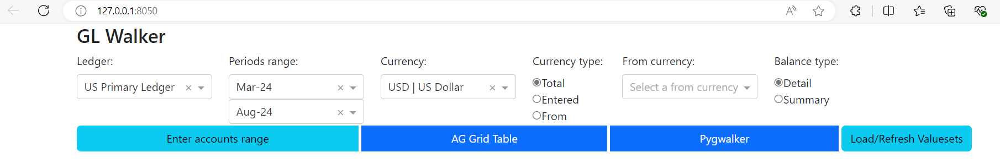
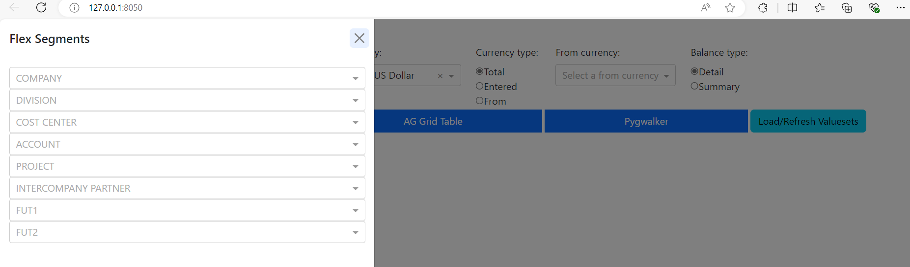
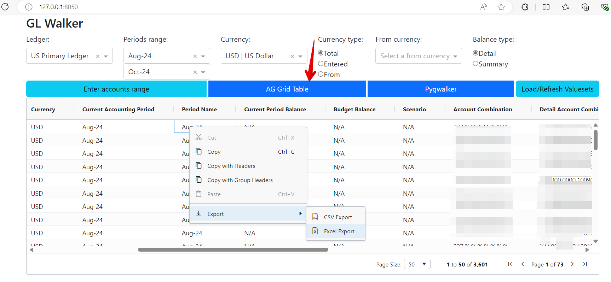
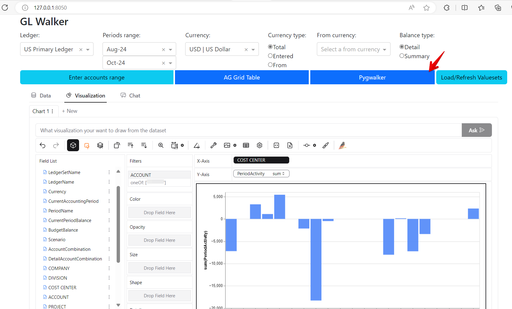

# GLWALKER
Oracle Fusion GL Balance API visualizer

## Overview

This repository contains a Python **Dash** application. Dash is a Python framework for building web applications with highly interactive data visualizations. The application also utilizes **Ag-Grid** for powerful data grid features, **Pygwalker** for visual data exploration, **Pandas** for data manipulation, **DuckDB** for efficient SQL-based querying, and integrates with the Oracle Fusion Ledger Balances API ([API Documentation](https://docs.oracle.com/en/cloud/saas/financials/24c/farfa/op-ledgerbalances-get.html)) to retrieve ledger balance data. This guide will walk you through the process of installing the required dependencies and running the application on your local machine.
## Prerequisites

To run this application, you need the following software installed:

* **Python 3.12** or later: Make sure Python is installed. You can download it from python.org.

* **Git:** (Optional) If you wish to clone the repository directly.
## Installation Guide

Follow these steps to set up the application locally.

### Step 1: Clone the Repository

First, clone the repository from GitHub to your local machine. You can do this by running the following command in your terminal:

`git clone https://github.com/krokozyab/GLWALKER.git`

### Step 2: Set Up a Virtual Environment

Navigate to the cloned repository and create a virtual environment to manage the project dependencies.

`cd GLWALKER`
`python -m venv venv`

Activate the virtual environment:

* **On Windows**:

`venv\Scripts\activate`

* **On macOS/Linux**:

`source venv/bin/activate`

### Step 3: Install Dependencies

Install the necessary packages using pip. The dependencies are listed in the requirements.txt file.

`pip install -r requirements.txt`

If you don't have a requirements.txt file, create one by running:

`pip freeze > requirements.txt`

This will save all your current Python environment dependencies.

### Step 4: Configure the `.env` File
Create a `.env` file by following the provided `sample.env` file, ensuring that all necessary environment variables are correctly defined.

### Step 4: Configure the `gl_list.json` File
The `gl_list.json` file represents the Chart of Accounts (COA) structure. Since there is no available API to retrieve this information, it must be configured manually. A SQL script (`gl_ledger_struct.sql`) has been provided to help obtain the necessary attributes. You can execute this script within the Fusion OTBI data model to extract the required data. Then, use the provided sample file (`lg_list_sample.json`) as a reference to create the final `lg_list.json` file.
## Running the Application

To start the Dash application, run the following command:

`python main.py`

This should launch the Dash application, and it will be available in your web browser at:

`http://127.0.0.1:8050/`

## Customization

If you need to modify the application, edit the Python scripts in the repository. Any changes will be reflected after you save the files and restart the server.

## Troubleshooting

ModuleNotFoundError: Ensure you are in the virtual environment and all dependencies are installed properly.

Port Issue: If `8050` is in use, you can change the port in the app.run_server() function:

`app.run_server(debug=True, port=8051)`

## Contributing

Feel free to submit pull requests to contribute to the project. For major changes, please open an issue first to discuss what you would like to change.

## License

This project is licensed under the MIT License. See the LICENSE file for more details.

## Contact

If you have questions, feel free to reach out via GitHub Issues or [email@rudenko.s@gmail.com].

## Sample screen shots

